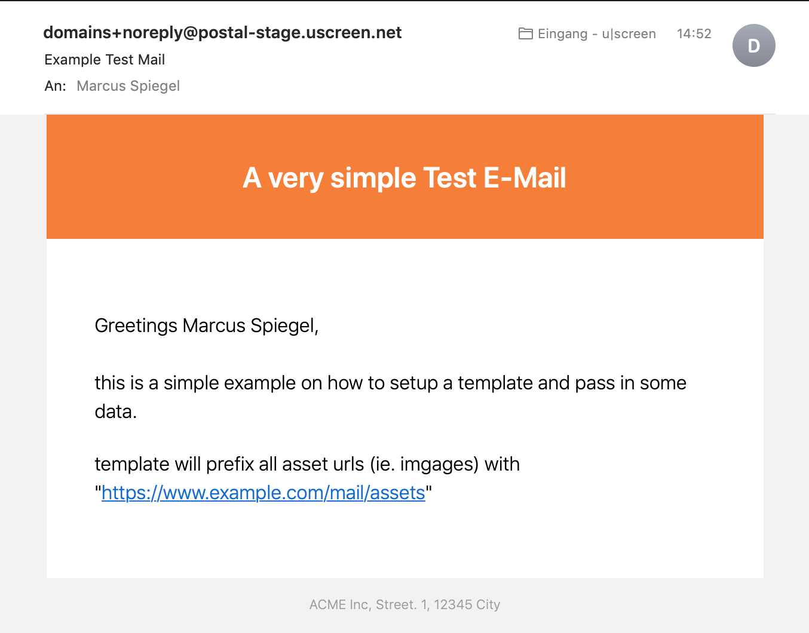

# postal-mailer

[](https://github.com/uscreen/postal-mailer/actions/workflows/node.js.yml)
[](https://coveralls.io/github/uscreen/postal-mailer?branch=master)
[](https://snyk.io/test/github/uscreen/postal-mailer?targetFile=package.json)
[](https://badge.fury.io/js/@uscreen.de%2Fpostal-mailer)

> Mailer engine using mjml templates to send mail via postal api or smtp

## Features

* configure inline (json object) or by dotenv
* uses handlebars + mjml for compilation and render
* sends mails via postal api or smtp
* supports layout inheritance to reduce template duplication

## Install

```sh
$ yarn add @uscreen.de/postal-mailer # or use npm -i
```

## Example 

```js
const mailer = require('@uscreen.de/postal-mailer')({
  // load config defaults from .env file (defaults to false)
  useDotenv: true,

  // override with inline options if needed
  postalSender: 'domains+noreply@postal-stage.uscreen.net'
})

const result = await mailer
  .sendMail({
    data,
    template: 'test',
    to: 'rcpt@example.com',
    subject: 'Example Test Mail'
  })
  .then(r => {
    console.log('RESULT:', r)
  })
  .catch(e => {
    console.error('ERROR sending mail:', e)
  })
```

## Template

Please refer to https://mjml.io and https://handlebarsjs.com. Start with example like so:

```html
<mjml>
  <mj-head>
    <mj-title>Test Mail</mj-title>
    <mj-attributes>
      <mj-all font-family="BlinkMacSystemFont, -apple-system, 'Segoe UI', 'Roboto', 'Oxygen', 'Ubuntu', 'Cantarell', 'Fira Sans', 'Droid Sans', 'Helvetica Neue', 'Helvetica', 'Arial', sans-serif;"></mj-all>
      <mj-text font-weight="300" font-size="16px" color="#000000" line-height="24px"></mj-text>
    </mj-attributes>
  </mj-head>

  <mj-body background-color="#F2F2F2">

    <mj-section background-color="#ff781e" padding="20px">
      <mj-column width="100%">
        <mj-text align="center" font-size="24px" color="#ffffff" font-weight="600">
          A very simple Test E-Mail
        </mj-text>
      </mj-column>
    </mj-section>

    <mj-section background-color="#FFFFFF" padding="40px 20px">
      <mj-column width="100%">
        <mj-text>
          Greetings {{user.firstName}} {{user.lastName}},<br>
          <br>
          this is a simple example on how to setup a template and pass in some data.
        </mj-text>
        <mj-text>
          template will prefix all asset urls (ie. imgages) with<br>"{{postalAssetsUrl}}"
        </mj-text>
      </mj-column>
    </mj-section>

    <mj-section padding="0px 0 20px 0">
      <mj-column>
        <mj-text align="center" color="#9B9B9B" font-size="11px">ACME Inc, Street. 1, 12345 City</mj-text>
      </mj-column>
    </mj-section>

  </mj-body>
</mjml>
```
which renders to something like this:



### Layout System

To reduce repetition in your email templates, you can use the layout inheritance system. This allows you to define a base layout with common elements (header, footer, styles) and only write the unique content for each email.

#### Creating a Layout

Create a layout file in a `layouts` subdirectory within your template locale folder:

```html
<!-- templates/en/layouts/base.mjml -->
<mjml>
  <mj-head>
    <mj-title>{{title}}</mj-title>
    <mj-preview>{{preview}}</mj-preview>
    <mj-attributes>
      <mj-all font-family="Arial, sans-serif" />
    </mj-attributes>
    <mj-style>
      /* Common styles */
      {{#if customStyles}}{{{customStyles}}}{{/if}}
    </mj-style>
  </mj-head>
  <mj-body>
    <!-- Common header -->
    <mj-section>
      <mj-column>
        <mj-text>{{companyName}}</mj-text>
      </mj-column>
    </mj-section>
    
    <!-- Main content -->
    {{{content}}}
    
    <!-- Common footer -->
    {{#unless hideFooter}}
    <mj-section>
      <mj-column>
        <mj-text>© 2024 {{companyName}}</mj-text>
      </mj-column>
    </mj-section>
    {{/unless}}
  </mj-body>
</mjml>
```

#### Using a Layout

To use a layout in your template, add a front matter section at the top:

```html
<!-- templates/en/welcome.mjml -->
<!-- @meta
layout: base.mjml
title: "Welcome to Our Service"
preview: "Get started with your new account"
-->

<!-- @styles -->
.highlight { color: #ff6600; }
<!-- @endstyles -->

<!-- @content -->
<mj-section>
  <mj-column>
    <mj-text>
      Welcome {{user.firstName}}!
    </mj-text>
    <mj-text css-class="highlight">
      Your account is ready to use.
    </mj-text>
  </mj-column>
</mj-section>
<!-- @endcontent -->
```

#### Layout Directives

- `@meta` - Front matter section containing layout and variables
  - `layout:` - Specifies which layout file to use (relative to the layouts directory)
  - Other key-value pairs become variables passed to the layout
- `@styles` / `@endstyles` - Adds custom CSS styles to the layout
- `@content` / `@endcontent` - Wraps the main content of your email

All template data passed to `sendMail()` is also available in the layout.

## Options

All options can be managed via `.env` file and/or inline configuration as seen above. Overview of options:

| option                  | Description                                                                                                 | Default           | Example                             |
|-------------------------|-------------------------------------------------------------------------------------------------------------|-------------------|-------------------------------------|
| __useDotenv__           | whether to also read options from `.env` files                                                              | `false`           | `true`                              |
| __postalTransport__     | Send mail via Postal API or SMTP                                                                            | `postal`          | `smtp`                              |
| __postalServer__        | Postal Server Host                                                                                          |                   | postal.example.com                  |
| __postalPort__          | If sending via SMTP, the SMTP port                                                                          | 25                | 25                                  |
| __postalUser__          | If sending via SMTP, the SMTP username                                                                      |                   | acme/my-api                         |
| __postalKey__           | If sending via Postal API, the API Key to use. If sending via SMTP, the SMTP password                       |                   | ExAmPlE_key                         |
| __postalSender__        | From Address in emails                                                                                      |                   | noreply@example.com                 |
| __postalTemplates__     | path to directory containing email templates                                                                | `<cwd>/templates` | ./templates/mails                   |
| __postalAssetsUrl__     | url to prefix assets                                                                                        | `''`              | https://www.example.com/mail/assets |
| __postalDefaultLocale__ | when set, locales will default to 'en' and templates will default `./templates/en` instead of `./templates` | `''`              | 'en'                                |

## API

#### mailer.sendMail({ template, data, to, subject, locale = '' })

Send a `template` rendered with `data` `to` a recepient with a `subject`.
(In an optional language set by `locale`)

## Roadmap

- use esm (or shim with https://github.com/standard-things/esm)
- upgrades:
    ◯ globby        latest  11.0.4  ❯  12.0.2  https://github.com/sindresorhus/globby#readme
- deplrecate postalAssetsUrl as this is implementation context

## Changelog

### 1.0.0

- added layout inheritance system for templates
- templates can now extend from base layouts to reduce duplication
- added support for layout variables and custom styles
- uses gray-matter for safe and reliable front matter parsing

### 0.6.0

- added smtp example
- fixed pending upgrades

### 0.5.0

- added support of attachments
- added smtp transport

### 0.2.0

- added (optional) multilanguage support for templates
- added examples and docs

### 0.1.0

- rendering of templates (to html + text) & sending thru api works

